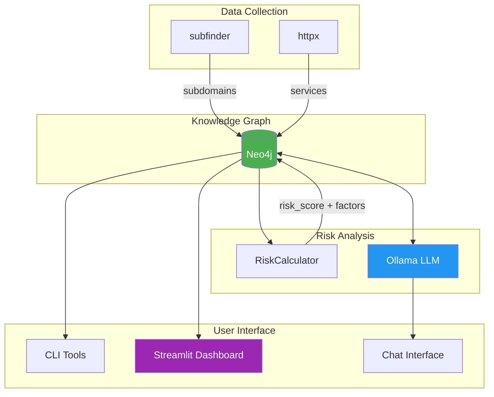

# ExposureGraph

This was one cool project that I have been trying to implement for sometime. 

Can we transform security reconnaissance data into prioritized, explainable insights using a Knowledge Graph and local LLM? Yes we can!

[](https://opensource.org/licenses/MIT)
[](https://www.python.org/downloads/)
[](https://neo4j.com/)

---

## Overview

ExposureGraph is an open-source exposure management tool/project that:

1. **Discovers** your attack surface using reconnaissance tools (subfinder, httpx)
2. **Stores** asset relationships in a Neo4j Knowledge Graph
3. **Calculates** explainable risk scores with transparent factors
4. **Enables** natural language queries via local LLM (Ollama)
5. **Visualizes** your security posture through an interactive Streamlit dashboard

### Why ExposureGraph?

Security teams drown in scanner output but lack **context**. A vulnerability on a forgotten staging server is different from one on your payment API. ExposureGraph transforms raw data into prioritized, explainable intelligence.

| Problem | ExposureGraph Solution |
|---------|------------------------|
| Scanner output is flat lists | Knowledge Graph captures relationships |
| Risk scores are black boxes | Every score has explainable factors |
| Queries require Cypher/SQL knowledge | Ask questions in natural language |
| Data stays in spreadsheets | Interactive dashboard with drill-down |

---

## Architecture



### Data Flow

```
┌─────────────┐     ┌─────────────┐     ┌─────────────┐
│  subfinder  │────▶│   Neo4j     │◀────│  Streamlit  │
│   httpx     │     │  Knowledge  │     │  Dashboard  │
│             │     │    Graph    │     │  + Chat     │
└─────────────┘     └──────┬──────┘     └─────────────┘
                           │
                    ┌──────▼──────┐
                    │   Ollama    │
                    │  Llama 3.1  │
                    └─────────────┘
```

### Graph Schema

```
(:Domain {name: "acme-corp.com"})
        │
        │ [:HAS_SUBDOMAIN]
        ▼
(:Subdomain {fqdn: "api.acme-corp.com"})
        │
        │ [:HOSTS]
        ▼
(:WebService {url, status_code, risk_score, risk_factors, ...})
```

---

## Features

- [x] **Subdomain Discovery** - Passive reconnaissance via subfinder
- [x] **HTTP Fingerprinting** - Service detection with httpx (status, title, server, technologies)
- [x] **Knowledge Graph Storage** - Neo4j with relationship modeling
- [x] **Explainable Risk Scoring** - Transparent factors (non-production, version disclosure, outdated tech)
- [x] **Natural Language Queries** - Ask questions, get Cypher + summaries
- [x] **Local LLM** - Privacy-preserving with Ollama (no cloud API calls)
- [x] **Interactive Dashboard** - Metrics, charts, filterable asset list
- [x] **Chat Interface** - Conversational queries with suggested questions
- [x] **Demo Mode** - Realistic seed data for demonstrations

---

## Tech Stack

| Component | Technology | Purpose |
|-----------|------------|---------|
| Language | Python 3.11+ | Core application |
| Graph DB | Neo4j 5.x Community | Knowledge graph storage |
| LLM | Ollama + Llama 3.1 (8B) | Natural language queries |
| UI | Streamlit | Dashboard and chat |
| Charts | Plotly | Interactive visualizations |
| CLI | Typer + Rich | Command-line interface |
| Recon | subfinder, httpx | Asset discovery |
| Containers | Docker Compose | Infrastructure |

---

## Quick Start

### Prerequisites

- [Docker Desktop](https://www.docker.com/products/docker-desktop/) installed
- [Python 3.11+](https://www.python.org/downloads/) with pip
- [Ollama](https://ollama.ai/) installed (optional, for real LLM queries)

### 1. Clone and Setup

```bash
git clone https://github.com/yourusername/exposure-graph.git
cd exposure-graph

# Install Python dependencies
pip install -r requirements.txt
```

### 2. Start Neo4j

```bash
docker-compose up -d

# Wait ~30 seconds for Neo4j to initialize
# Verify: open http://localhost:7474 in browser
```

### 3. Seed Demo Data

```bash
python scripts/seed_demo.py

# Or use Docker profile for one-command setup:
# docker-compose --profile demo up
```

### 4. Launch Dashboard

```bash
streamlit run src/ui/app.py

# Open http://localhost:8501 in browser
```

### 5. Try It Out

**Dashboard Page:** View metrics, risk distribution, and top risky assets

**Assets Page:** Search and filter services, drill into risk breakdowns

**Chat Page:** Ask questions like:
- "What are our riskiest assets?"
- "Show me staging servers"
- "What services run nginx?"

---

## CLI Usage

### Run a Scan (Authorized Targets Only)

```bash
# Scan a domain (must be in ALLOWED_TARGETS)
python scripts/run_scan.py scan scanme.sh

# Check graph status
python scripts/run_scan.py status
```

### Query with Natural Language

```bash
# With Ollama running
python scripts/query.py "What are the riskiest assets?"

# Mock mode (no Ollama needed)
python scripts/query.py --mock "Show staging servers"

# See example queries
python scripts/query.py examples
```

---

## Configuration

Environment variables (or `.env` file):

```bash
# Neo4j
NEO4J_URI=bolt://localhost:7687
NEO4J_USER=neo4j
NEO4J_PASSWORD=           # Empty for local dev

# Ollama
OLLAMA_HOST=http://localhost:11434
OLLAMA_MODEL=llama3.1:8b

# Security
ALLOWED_TARGETS=scanme.sh,example.com

# Development
MOCK_LLM=false            # Set true to skip Ollama
LOG_LEVEL=INFO
```

---

## Risk Scoring Model

Every asset receives a score from 0-100 with transparent contributing factors:

| Factor | Points | Condition |
|--------|--------|-----------|
| Base Score | 20 | Every exposed service |
| Live Service | +30 | HTTP 200 response |
| Non-Production | +15 | URL contains staging/dev/test/uat |
| Version Disclosure | +10 | Server header reveals version |
| Outdated Technology | +20 | Known EOL software detected |
| No HTTPS | +15 | Unencrypted HTTP |
| Directory Listing | +10 | "Index of" in page title |

**Example Breakdown:**
```
https://staging.api.example.com
Score: 75/100

  +20  Base Score
  +30  Live Service (HTTP 200)
  +15  Non-Production ("staging" in URL)
  +10  Version Disclosure (nginx/1.18.0)
```

---

## Project Structure

```
exposure-graph/
├── README.md              # This file
├── DISCLAIMER.md          # Legal disclaimer
├── LICENSE                # MIT License
├── docker-compose.yml     # Neo4j + demo seeder
├── requirements.txt       # Python dependencies
├── config.py              # Pydantic settings
│
├── src/
│   ├── collectors/        # subfinder, httpx wrappers
│   ├── graph/             # Neo4j client and models
│   ├── scoring/           # Risk calculator
│   ├── ai/                # LLM client and query agent
│   └── ui/                # Streamlit application
│
└── scripts/
    ├── run_scan.py        # CLI for scanning
    ├── query.py           # CLI for natural language queries
    └── seed_demo.py       # Demo data generator
```

---

## Development

### Running Tests

```bash
# Manual testing workflow 
docker-compose up -d
python scripts/seed_demo.py
streamlit run src/ui/app.py

# Test queries
python scripts/query.py --mock "What are our riskiest assets?"
```

### Code Style

- Format with `black` (line length 100)
- Sort imports with `isort`
- Type hints required
- Google-style docstrings

---

## Contributing

Contributions are welcome! Please:

1. Fork the repository
2. Create a feature branch (`git checkout -b feature/amazing-feature`)
3. Make your changes
4. Run manual tests to verify functionality
5. Commit with descriptive message (`git commit -m 'Add amazing feature'`)
6. Push to the branch (`git push origin feature/amazing-feature`)
7. Open a Pull Request

### Ideas for Contribution

- Additional collectors (nuclei, nmap)
- More risk factors (SSL certificate issues, CORS misconfiguration)
- Vulnerability correlation (CVE lookup based on detected versions)
- Scheduled scanning
- Export functionality (CSV, PDF reports)
- Additional visualizations (network graph, timeline)

---

## Troubleshooting

| Issue | Solution |
|-------|----------|
| "Neo4j connection refused" | Run `docker-compose up -d`, wait 30s |
| "Ollama model not found" | Run `ollama pull llama3.1:8b` |
| "subfinder not found" | Install Go, then `go install github.com/projectdiscovery/subfinder/v2/cmd/subfinder@latest` |
| "httpx wrong version" | Ensure Go httpx is in PATH before Python httpx |
| "LLM responses are slow" | Use smaller model (`llama3.2:3b`) or enable mock mode |
| "Streamlit won't start" | Run `pip install --upgrade streamlit` |

---

## Security Notice

**This tool is for authorized security testing only.**

- Only scan domains you own or have explicit permission to test
- Default allowed targets: `scanme.sh` (ProjectDiscovery's test domain)
- Never use against systems without written authorization

See [DISCLAIMER.md](DISCLAIMER.md) for full legal notice.

---

## License

This project is licensed under the MIT License - see the [LICENSE](LICENSE) file for details.

---

## Acknowledgments

- [ProjectDiscovery](https://projectdiscovery.io/) for subfinder and httpx
- [Neo4j](https://neo4j.com/) for the graph database
- [Ollama](https://ollama.ai/) for local LLM inference
- [Streamlit](https://streamlit.io/) for rapid UI development

---

**Built as a portfolio project demonstrating modern security tooling with AI integration.**
